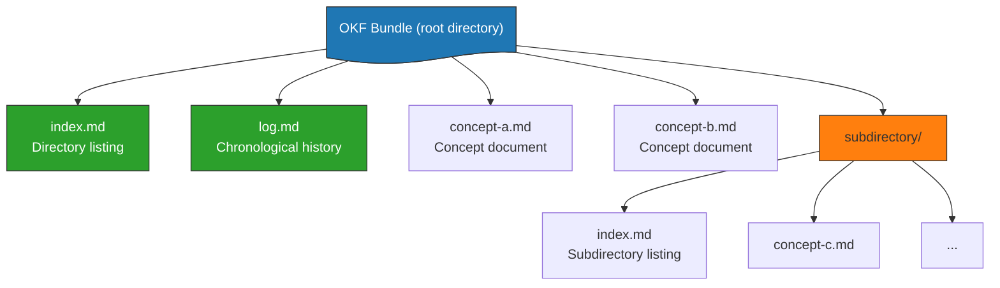

# OKF Format

> **Open Knowledge Format v0.2** — a specification, not a platform. v0.1 (June 12, 2026) formalized the LLM-Wiki pattern; v0.2 (current) answers three questions a plain markdown convention cannot: *where did this come from*, *how much should I trust it*, *is it still true*.[^okf-spec]

## What Is OKF?

OKF standardizes the representation of knowledge bases as directories of markdown files with YAML frontmatter. It is:

- **Vendor-neutral** — no required SDK, account, or central authority
- **File-based** — directories of `.md` files, portable via git, tarball, or zip
- **Interoperable** — any producer (human, agent, export pipeline) and any consumer (visualizer, query agent, static site generator) share one format
- **Minimally opinionated** — only one required field, `type`
- **Permissive** — consumers must tolerate unknown fields, unknown types, and broken links

The specification is self-contained and free of tooling requirements: if you can read a file, you can read OKF.[^okf-spec]

## Bundle Structure

An OKF bundle is a directory tree of markdown files. Two filenames are reserved: `index.md` (progressive disclosure listing) and `log.md` (change history).



A bundle MAY be distributed as a git repository (recommended), a tarball/zip, or a subdirectory of a larger repository. A `references/` subdirectory conventionally mirrors external material as first-class concepts (§6.3).

## Concept Documents

Every concept is a UTF-8 markdown file with a YAML frontmatter block and a markdown body.

### Frontmatter — required, recommended, optional

```yaml
---
type: BigQuery Table              # REQUIRED — the only always-required key
title: Customer Orders            # Recommended display name
description: One row per order.   # Recommended one-line summary
resource: https://...             # Recommended canonical URI of the underlying asset
tags: [sales, orders, revenue]    # Recommended cross-cutting categorization
# --- optional v0.2 families (all of §5, §10) ---
sources:
  - id: ga4-schema
    resource: https://developers.google.com/analytics/bigquery/export-schema
    title: GA4 BigQuery Export schema
    author: team:ga4-docs
    usage_count: 5000
    last_modified: 2026-05-30T00:00:00Z
usage_window: { from: 2026-06-01T00:00:00Z, to: 2026-06-30T00:00:00Z }
generated: { by: reference_agent/gemini-2.5-pro, at: 2026-06-20T22:53:05Z }
verified:
  - { by: human:ahormati, at: 2026-06-25T09:00:00Z }
status: stable
stale_after: 2026-09-23T00:00:00Z
---
```

`type` values are **not** registered centrally: producers pick descriptive, self-explanatory values and consumers tolerate unknown ones by treating them as generic concepts. Extensions are explicitly allowed — any additional producer-defined keys — and consumers SHOULD preserve them on round-trip.

### Body

Standard markdown; structural markdown (headings, lists, tables, fenced code) is preferred because it aids both human reading and agent retrieval. No body section is required. Three headings carry conventional meaning:

| Heading | Purpose |
|---------|---------|
| `# Schema` | Structured description of an asset's columns/fields |
| `# Examples` | Concrete usage examples, usually fenced code |
| `# Computation` | The sanctioned computation of an `Attested Computation` concept |

## §5 — Provenance, Trust, Lifecycle

All three families are **optional**, and their absence carries meaning: an unverified concept is distinguishable from a verified one, yet never rejected. Every timestamp-valued key is ISO 8601 with an explicit UTC offset.

### Provenance: `sources`

`sources` records the materials a concept derives from. Each entry requires `resource` — an absolute URL, a bundle-relative path (e.g. `/references/revenue.md`), or a scope descriptor the consumer cannot follow (e.g. `all queries in project X`). Optional: `id` (a stable join key), `title`, and the credibility signals `author`, `usage_count`, `last_modified`; the sibling `usage_window: {from, to}` frames every `usage_count`.

OKF deliberately stores **no credibility score** — a score is subjective, unportable, and goes stale. Credibility is inferred from signals, the same way trust tiers are. `usage_count` is a coarse liveness signal, readable at the alive/dead and order-of-magnitude level, not a precise cross-kind ranking.

Lineage is expressed by links, not a dedicated field: when a `resource` points at another concept, the derivation edge already exists in the graph and a consumer MAY recurse into that source's own `sources`.

**Per-claim attribution** uses footnotes keyed to `sources[].id` — `.[^ga4-schema]` — never a body `# Citations` list (the v0.1 form, still tolerated). Labels are keyed rather than positional because agents rewrite these documents constantly: a positional index misattributes silently the moment the list is reordered.

### Trust: `generated` and `verified`

`generated` records how the content was produced; `verified` records who or what confirmed it. They are distinct because the writer need not be the confirmer.

- `generated.by` — REQUIRED within `generated`; an actor. `generated.at` — ISO 8601, the content's last meaningful change.
- `verified` — a list of `{ by, at }` events; a bare mapping is treated as a one-element list. Multiple entries capture independent checks (a human sign-off plus a nightly process).

**Actor convention** (§7): `<producer>/<version>` for agents and tools (`reference_agent/gemini-2.5-pro`), `human:<id>` for a person, `process:<id>` for an automated process. Consumers key trust classification off the `human:` prefix.

### Trust tiers (§5.3)

| `verified` | Derived tier |
|------------|--------------|
| absent | **unverified** |
| only non-`human:` actors | **machine-confirmed** |
| at least one `human:<id>` actor | **human-reviewed** |

Tiers are advisory signals, not access control.

### Lifecycle: `status` and `stale_after`

- `status`: `draft` (not yet reviewed) · `stable` (default, ready for consumption) · `deprecated` (kept for links and history). Absent ⇒ `stable`.
- `stale_after`: an absolute instant; the concept is stale when `now >= stale_after`. An absolute instant rather than a relative TTL keeps staleness a plain comparison with no reference to read time.

### Attested Computation (§10)

v0.2 adds one concept type, `Attested Computation`, with the keys `runtime`, `parameters`, `computation`, `executor`, `attester`. A computation is its own concept; a consumer runs it and receives a receipt, then a verdict. This vault does not use it yet.

## §11 — Conformance

A bundle is conformant with OKF v0.2 if:

1. Every non-reserved `.md` file contains a parseable YAML frontmatter block.
2. Every frontmatter block contains a non-empty `type` field.
3. Every reserved filename (`index.md`, `log.md`) follows §8/§9 when present.

When the optional families are present, producers SHOULD follow §5–§10 and consumers MUST treat a bare `verified` mapping as a one-element list, MUST NOT reject a concept for a missing optional family, and SHOULD surface rather than silently drop a failing attestation. Consumers MUST NOT reject a bundle for missing optional fields, unknown `type` values, unknown extra keys, broken cross-links, or missing `index.md` files.

## Changes from v0.1 (§13)

**Breaking (two, with fallbacks):**

| v0.1 | v0.2 | Fallback |
|------|------|----------|
| `timestamp` | `generated.at` (with `generated.by`) | consumers MAY read legacy `timestamp` when `generated` is absent |
| body `# Citations` list | frontmatter `sources` (per-claim footnotes) | consumers MAY still parse the legacy list |

**Additive:** the `sources` family and its credibility signals; `usage_window`; `generated`; `verified`; `status`; `stale_after`; the `Attested Computation` type and its keys; the `# Computation` heading; the actor convention. Their absence yields a plain v0.1 concept — which is why adopting v0.2 is a minor bump, not a rewrite.

## Nova Profile — how this vault uses v0.2

This vault (see `AGENTS.md` §3) adopts v0.2 as **OKF v0.2 + Nova extensions**:

| Aspect | Decision |
|--------|----------|
| Required surface | `type` only, exactly as the spec — every note keeps a parseable frontmatter block |
| `status` | Nova keeps its richer maturity enum as a producer extension, mapped to the OKF tier: **seedling/budding → draft · evergreen → stable · superseded/archived → deprecated** |
| Graph edges | Obsidian wiki links `[[note]]` (Obsidian-first vault) instead of §6.1 markdown links — a deliberate deviation, documented in §3 |
| Hubs | Root `index.md` and cluster hubs (`concepts.md`, `patterns.md`, …) are typed nodes with frontmatter — an extension of §8, which permits frontmatter only for `okf_version` |
| `log.md` | Heading form `## [YYYY-MM-DD] <op> \| <desc>` — an extension of §9 that retains the ISO date |
| Legacy notes | Keep `timestamp` (v0.2 fallback) and migrate to `generated.at` on next edit rather than fabricating a `generated.by` retrospectively |
| `sources` entries | New notes use `id` + `resource` (+ `title`); legacy entries use a `url` key, which consumers tolerate as an unknown extension |

## Reserved Filenames

| Filename | Purpose | Notes |
|----------|---------|-------|
| `index.md` | Directory listing (progressive disclosure) | No frontmatter except a bundle-root `okf_version`; entries SHOULD reuse the linked concept's `description` |
| `log.md` | Change history | Date-grouped, newest first; date headings MUST be ISO `YYYY-MM-DD`; the leading bold word (`**Update**`, `**Creation**`, `**Deprecation**`) is convention, not requirement |

All other `.md` files are concept documents.

## Link Forms

- **Bundle-relative (recommended)** — begins with `/`: `[customers table](/tables/customers.md)`; stable when documents move within their subdirectory.
- **Relative** — `[neighboring concept](./other.md)`.
- **Semantics** — a link from A to B asserts a *relationship*; the kind (parent/child, references, depends-on) lives in the surrounding prose, and graph consumers treat all links as directed edges of an untyped relationship. Broken links are tolerated: they may represent not-yet-written knowledge.

## Three Design Principles

1. **Minimally opinionated** — only `type` is required; OKF defines the interoperability surface, not the content model.
2. **Producer/consumer independence** — a human wiki consumed by an agent, an export browsed in a visualizer, an LLM bundle queried by another LLM: same format, swappable tooling at each end.
3. **Format, not platform** — no account, SDK, or cloud. The value of a knowledge format scales with adoption breadth, not vendor lock-in.

## Relationship to Karpathy's LLM Wiki

OKF cites [[karpathy-llm-curriculum|Karpathy's LLM Wiki gist]] as its inspiration.[^karpathy-wiki] The three-layer mapping:

| Karpathy Layer | OKF Equivalent | Notes |
|----------------|----------------|-------|
| Raw sources (immutable) | external datasets, docs, APIs | OKF bundles are the *compiled* layer |
| Wiki (LLM-maintained) | OKF bundle (`*.md` + frontmatter) | OKF adds required `type`, recommended `resource`/`tags`, plus the v0.2 families |
| Schema (`CLAUDE.md`) | producer/consumer conventions + `SPEC.md` | an org-wide spec replaces per-vault bespoke rules |

Both reserve `index.md` (catalog) and `log.md` (change history). Karpathy's pattern is a **method**; OKF is a **specification** that makes the method interoperable across wikis. The progressive-disclosure role of `index.md` is elaborated in [[progressive-disclosure|Progressive Disclosure]].

## Reference Implementations

| Tool | Type | Purpose |
|------|------|---------|
| BigQuery enrichment agent | Producer | walks a dataset, drafts OKF docs per table/view, enriches with an LLM |
| Static HTML visualizer | Consumer | force-directed graph (Cytoscape.js) over any bundle — one HTML file, no backend |
| Sample bundles | Demo | GA4 e-commerce, Stack Overflow, Bitcoin datasets |

## Why OKF Enables Offline-First Knowledge Bases

- **Just files** — shippable as a tarball, hostable in any git repository
- **No runtime** — read a file and you are reading OKF
- **Git-native** — diffs, blame, branches, and review work unchanged
- **No search infrastructure** — `index.md` provides progressive disclosure at small-to-medium scale
- **Any markdown editor** — Obsidian, VS Code, Notion, MkDocs, Hugo, Jekyll
- **No API dependencies** — broken external links are tolerated by design

## See Also

- [[markdown-frontmatter|Markdown Frontmatter]] — the YAML layer OKF builds on
- [[karpathy-llm-curriculum|Karpathy LLM Curriculum]] — the three-layer method OKF formalizes
- [[knowledge-graph-patterns|Knowledge Graph Patterns]] — turning a bundle into a graph
- [[progressive-disclosure|Progressive Disclosure]] — why `index.md` is the load-bearing file
- [[zettelkasten-methodology|Zettelkasten Methodology]] — atomicity and linking discipline
- [[selective-persistent-memory|Selective Persistent Memory]] — why boot reads a window, not everything

[^okf-spec]: OKF v0.2 specification — <https://github.com/GoogleCloudPlatform/open-knowledge-format/blob/main/SPEC.md> (fetched and read 2026-10-05; version line 3, §4.1, §5, §11–§13).
[^karpathy-wiki]: Karpathy, LLM Wiki gist — <https://gist.github.com/karpathy/442a6bf555914893e9891c11519de94f>.
